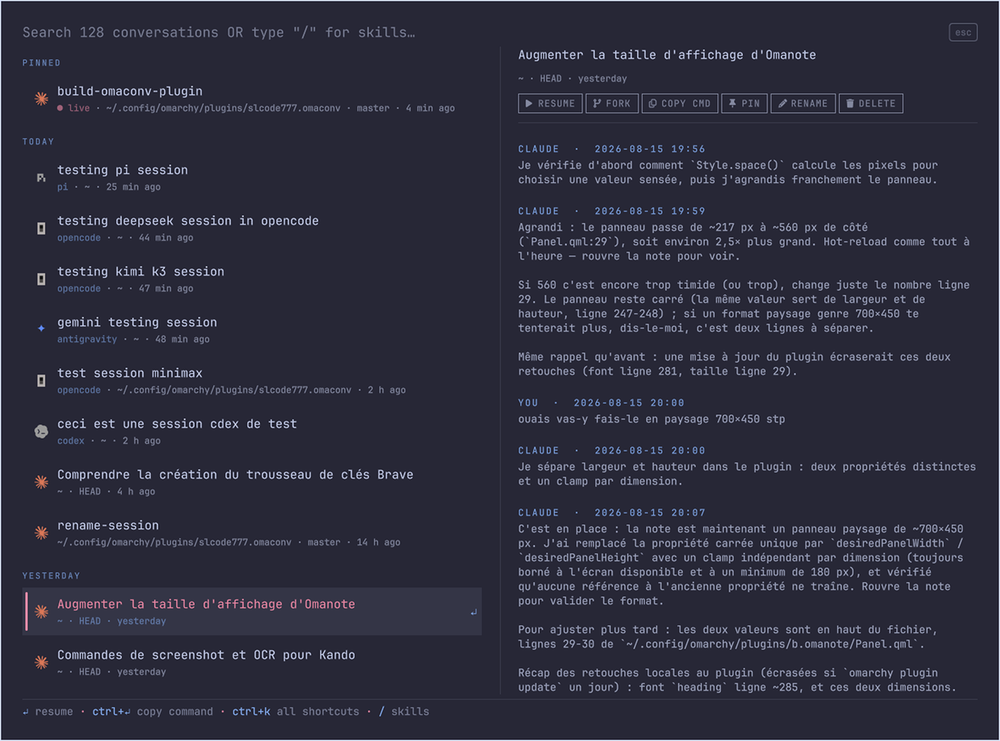

# Omaconv

Omaconv is a resume palette for [Claude Code](https://claude.com/claude-code)
conversations, built for the [Omarchy](https://omarchy.org/) shell. It lists
every conversation on the machine, finds them by searching their title, their
directory **and everything you actually typed in them**, and resumes any of
them in one keystroke — always in the right working directory.



## Why

Claude Code stores transcripts under `~/.claude/projects/<encoded-path>/`. To
resume a conversation you normally have to remember which directory it was
started from, `cd` there, and scroll through `claude --resume`. A conversation
whose directory you forgot is, in practice, lost. Omaconv fixes that: one
palette, fuzzy search over titles, paths and your own prompts, and a resume
that always lands in the conversation's original `cwd`.

## Install

```bash
omarchy plugin add https://github.com/SLcode777/omaconv.git --enable --yes
```

Then bind the toggle wherever you like (Hyprland keybinding, Kando entry, …):

```bash
omarchy-shell shell toggle slcode777.omaconv
```

## Use

Open the palette and just type — the search line is the input. The empty
palette shows your pinned conversations, then the 10 most recent grouped by
date (TODAY / YESTERDAY / THIS WEEK / OLDER). A result matched through a
prompt shows the matching excerpt with the term highlighted, so you always
know why a row is there. The right pane previews the selected conversation
as a readable YOU/CLAUDE dialogue — opened on the latest exchange, and
scrollable all the way back to the first one.

| Key      | Action                                                        |
| -------- | ------------------------------------------------------------- |
| `↵`      | Resume in the conversation's directory                        |
| `Alt+↵`  | Resume as a fork — new session, same context, original intact |
| `Ctrl+↵` | Copy the `cd … && claude --resume …` command                  |
| `Ctrl+P` | Pin / unpin                                                   |
| `Ctrl+R` | Rename (shows in Claude Code's own picker too)                |
| `Ctrl+O` | Open a terminal in the conversation's directory               |
| `Ctrl+T` | Reveal the transcript in the file manager                     |
| `Ctrl+G` | Search the full transcript, rendered as a readable dialogue   |
| `Ctrl+D` | Delete — to the trash, after confirmation                     |
| `Ctrl+K` | All shortcuts                                                 |
| `Esc`    | Clear the search, then close                                  |

Type `/` as the first character to switch to the **skills** namespace: it
lists the skills installed in `~/.claude/skills/`, searchable by name and
description. `↵` opens the skill's `SKILL.md`, `Ctrl+↵` copies `/name`.

Conversations whose directory no longer exists fall back to the most recent
directory that still does (marked `↪`), or are greyed out when none survives.
Conversations currently running as a background agent show a `● live` badge;
resuming one opens `claude agents` so you can attach instead.

## How it works

A small Python indexer (`omaconv-index`, stdlib only) scans the transcripts
and writes a JSON index to `~/.local/state/omaconv/`; the QML palette only
ever reads that index. On open, the cached list shows instantly while an
incremental reindex runs in the background — no daemon, no timers. Search is
pure in-memory JavaScript: accent- and case-insensitive, literal matching
over titles, paths and user prompts, ~0.5 ms per keystroke over a hundred
conversations.

## Privacy & security

- **No network access, ever. No LLM calls. No telemetry.**
- Reads only `~/.claude/`. The cache (which contains conversation excerpts)
  is written with mode `0600` to `~/.local/state/omaconv/`.
- Two explicit, deliberate writes into `~/.claude/`: **rename** appends a
  title line to the renamed transcript (append-only, the exact format Claude
  Code's own `/rename` writes — existing lines are never modified), and
  **delete** moves a transcript to the trash via `gio trash` (never `rm`,
  always recoverable).
- Every command is spawned as an argument array — values read from
  transcripts are treated as data, never interpolated into a shell string.

## Requirements

- Omarchy with the Quickshell shell (plugin API v1)
- `python3` (standard library only)
- `claude` on the `PATH`

Optional: `ugrep` (`omarchy pkg add ugrep`) upgrades `Ctrl+G` from a pager to
an interactive search TUI.

## Tests

```bash
python3 -m unittest discover -s tests   # indexer, renderer, edge cases
node tests/search-model.test.js         # search, sections, quoting
```

## Update / uninstall

```bash
omarchy plugin update slcode777.omaconv
omarchy plugin remove slcode777.omaconv
```

## License

[MIT](LICENSE)
